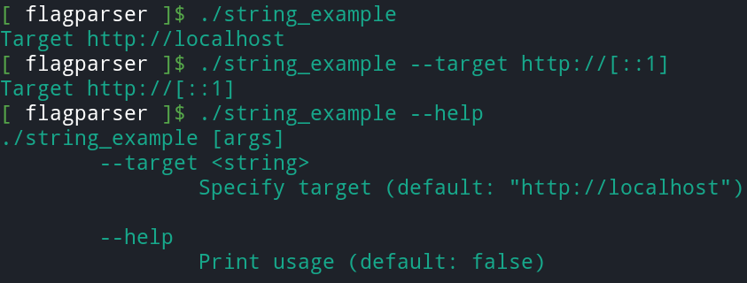
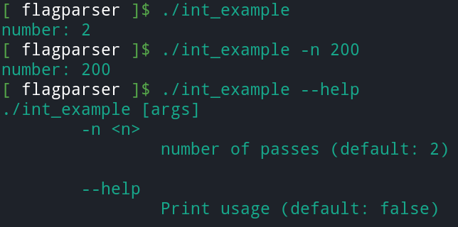
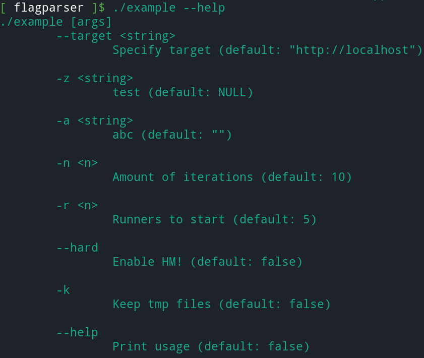

# flagparser

Somewhat inspired by the golang flags package. 
The idea is to have a minimal amount of effort to define cmdline 
arguments.

- include `flagparser.h`
- define some flags variables
  - `flg_str_var(string_ptr, name, default_value, help_string);`
  - `flg_int_var(int_ptr, name, default_value, help_string);`
  - `flg_bool_var(bool_ptr, name, help_string);`
- Parse the flags `flg_parse_flags(argc, argv);`. This will populate the previously provided pointers. This function can only be called once.
- When you are done using the string pointers you'll want to free them.

## API

```c
void flg_bool_var(bool *value, const char *name, const char *help_str);
void flg_int_var(int *value, const char *name, int default_value, const char *help_str);
void flg_str_var(char **value, const char *name, const char *default_value, const char *help_str);
void flg_parse_flags(const int argc, const char *argv[]);
```

Below are some API example.

### strings example

You create a string a new string argument with `flg_str_var`.

`flg_str_var(<string ptr>, <arg name>, <default value>, <help string>);`

Example code:

```c
#include "flagparser.h"
#include "stdio.h"

int main(int argc, const char *argv[])
{
    char *target = NULL;

    flg_str_var(&target           /* char *value */,  
               "--target"         /* char *name */, 
               "http://localhost" /* char *default_value */, 
               "Specify target"   /* char *help_str */);

    flg_parse_flags(argc, argv);

    /* your code */    
    printf("Target %s\n", target);

    /* Free the memory after you are done. */
    free(target);

    return 0;
}
```

For the string, `flg_str_var` will allocate memory for you.
You will have to free it if you are done with it to avoid memory 
leaking.

Example usage:



## switches example

Boolean flags are always false by default.
There is no parameter to specify a **default_value**.

`flg_bool_var(<string ptr>, <arg name>, <help string>);`

Notice that you can have multiple switches that set the same value.

```c
#include "flagparser.h"
#include "stdio.h"

int main(int argc, const char *argv[])
{
    bool enable_rw;
    bool keep;
    bool version;
    
    flg_bool_var(&enable_rw, "-e",          "Enable Read-Write");
    flg_bool_var(&enable_rw, "--enable-rw", "Enable Read-Write");
    flg_bool_var(&keep,      "-k",          "Keep original files");
    flg_bool_var(&version,   "--version",   "Print version");

    flg_parse_flags(argc, argv);
    
    if (enable_rw)
        puts("rw enabled");
    if (keep)
        puts("Keep original file");    
    if (version)
        printf("%s %s\n", argv[0], "v0.1");

    return 0;
}     
```

#### Alternative way to pass the ptr

An alternative (but inferior) way to create pass pointers is to 
create a ptr and allocate the required memory.
The downside is that you are also responsible to free the associated
memory afterwards.

```c
#include "flagparser.h"
#include "stdio.h"

int main(int argc, const char *argv[])
{
    bool *warnings = (bool *)malloc(sizeof(bool));

    /* bool *warnings = NULL;
     * ^ This would fail. flg_bool_var needs allocated memory. */
    
    flg_bool_var(warnings, "-w", "Enable warnings");

    flg_parse_flags(argc, argv);
    
    if (*warnings)
        puts("Warnings are enabled");

    free(warnings); /* Free your memory after you are ready */

    return 0;
}
```


## integers example

Similar to the boolean flags, it is advised to provide a value on the
stack.

```c
#include "flagparser.h"
#include "stdio.h"

int main(int argc, const char *argv[])
{
    int number = 0;
    
    flg_int_var(&number/* int *value */, 
                "-n"   /* char *name */, 
                2      /* int default_value */, 
                "number of passes" /* char *help_str */);

    flg_parse_flags(argc, argv);
    
    printf("number: %i\n", number);

    return 0;
}
```

Usage example:



## Built-in `--help`

The `--help` flag is built-in and will list the cmdline 
arguments when called together with their help string.




# Code guidelines

- Compiles under **c89** and **C++17**. (run `make test`)
- Identifiers use snake case
- Uses the prefix `flg_`.
