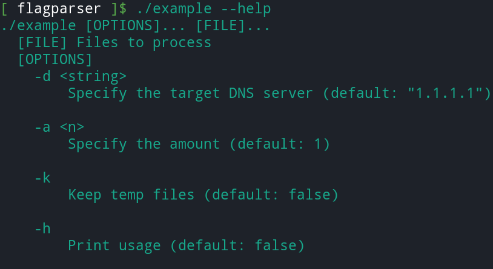

# flagparser

Somewhat inspired by the golang flags package. 
The idea is to have a minimal amount of effort to define cmdline 
arguments.

- include `flagparser.h`
- define some flags variables
  - `flg_str_var(<string **ptr>, <arg name>, <default value>, <help string>);`
  - `flg_bool_var(<bool *ptr>, <arg name>, <help string>);`
  - `flg_int_var(<int *ptr>, <arg name>, <default value>, <help string>);`
- Parse the flags `flg_parse_flags(argc, argv);`. This will populate the previously provided pointers. This function can only be called once.
- When you are done using the string pointers you'll want to free them.

## API

```c
void flg_bool_var(bool *value, const char *name, const char *help_str);
void flg_int_var(int *value, const char *name, int default_value, const char *help_str);
void flg_str_var(char **value, const char *name, const char *default_value, const char *help_str);
void flg_parse_flags(const int argc, const char *argv[]);
```

## Built-in `--help`

The `--help` flag is automatically built-in and will list the cmdline 
arguments when called together with their help string.



## strings example

You create a string a new string argument with `flg_str_var`.

- `flg_str_var(<string ptr>, <arg name>, <default value>, <help string>);`

Example code:

```c
char *target;

flg_str_var(&target, "-t", "http://localhost", "Specify target");

flg_parse_flags(argc, argv);

printf("Target: %s\n", target);

if (target)
    free(target);
```

Do not forget to free the string memory.


## switches example

Boolean flags are always false by default.

```c
bool keep;

flg_bool_var(&keep, "-k", "Keep original files");

flg_parse_flags(argc, argv);

if (keep)
    puts("Keep original file");      
```

In this example we defined the boolean on the stack. 
This means it does not need to be freed afterwards.

## integers example

Example code.

```c
int runners;

flg_int_var(&runners, "-r", 5, "Runners to start");

flg_parse_flags(argc, argv);

printf("Runners %d\n", runners);
```

Again we provide an integer on the stack so we don't need
to free it afterwards.